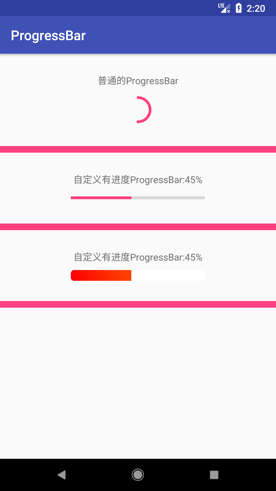

### 第一种：普通的ProgressBar

布局文件：

```xml
    <ProgressBar
        android:layout_width="wrap_content"
        android:layout_height="wrap_content"
        android:layout_marginTop="10dp" />
```

### 第二种：有进度横向的ProgressBar


布局文件：

```xml
   <ProgressBar
        android:id="@+id/mProgressBar"
        style="@style/Widget.AppCompat.ProgressBar.Horizontal"
        android:layout_width="200dp"
        android:layout_height="wrap_content"
        android:layout_marginTop="10dp"
        android:progress="12" />
```

代码：

```java
        final ProgressBar bar = (ProgressBar) findViewById(R.id.mProgressBar);
        final TextView textView= (TextView) findViewById(R.id.tv_progressBar);
        new Thread(){
            @Override
            public void run() {
                int i=0;
                while(i<100){
                    i++;
                    try {
                        Thread.sleep(80);
                    } catch (InterruptedException e) {
                        e.printStackTrace();
                    }
                    final int j=i;
                    bar.setProgress(i);
                    runOnUiThread(new Runnable() {
                        @Override
                        public void run() {
                            textView.setText("自定义有进度ProgressBar:"+j+"%");
                        }
                    });
                }
            }a
        }.start();
```

### 第三种：自定义有进度ProgressBar

布局文件：

```xml
    <ProgressBar
        android:id="@+id/mMyProgressBar"
        style="@style/Widget.AppCompat.ProgressBar.Horizontal"
        android:layout_width="200dp"
        android:layout_height="wrap_content"
        android:layout_marginTop="10dp"
        android:progress="12"
        android:progressDrawable="@drawable/custom_progress" />
```

使用到的custom_progress.xml文件：

```xml
<?xml version="1.0" encoding="utf-8"?>
<layer-list xmlns:android="http://schemas.android.com/apk/res/android">
    <item android:id="@android:id/background">
        <shape android:shape="rectangle">
            <corners android:radius="5dp" />
            <gradient
                android:endColor="#fff"
                android:startColor="#fff" />
        </shape>
    </item>
    <item android:id="@android:id/progress">
        <clip><!--可裁剪对象-->
            <shape android:shape="rectangle">
                <corners android:radius="5dp" />
                <gradient
                    android:angle="45"
                    android:endColor="#f90"
                    android:startColor="#f00" />
            </shape>
        </clip>
    </item>
</layer-list>
```